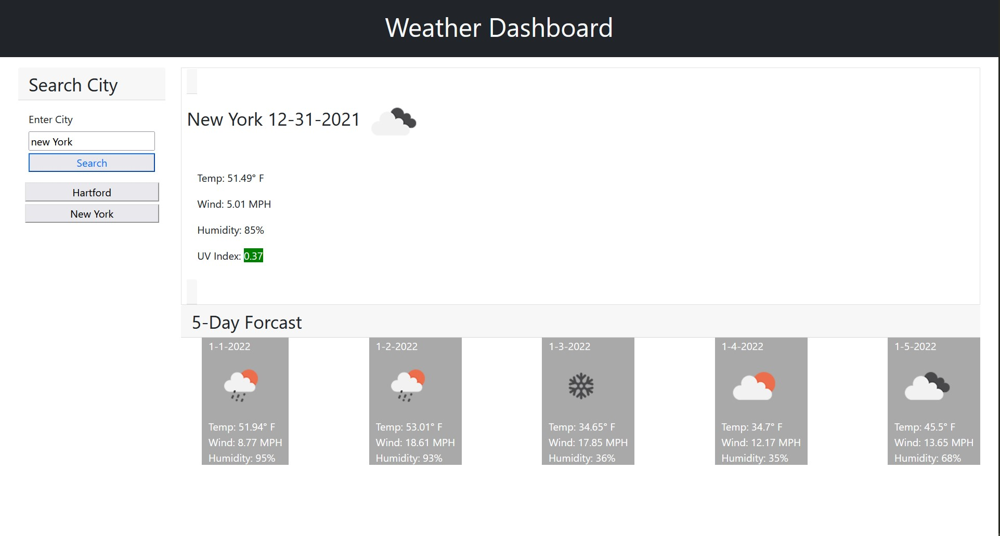

# Weather Dashboard
[Notes](#notes)  
(license-badge)[https://img.shields.io/ore/l/totaleconomy]

## Description
User may input the name of a city.  Using Open Weather Map api,the current weather and the five day forcast for that city will display.  
Data includes temperature, wind speed, UV index, and humidity. Danger of the UV index is color coded by severity.  
  
A five day forcast will also display.  
With each city searched, a button will be added to the side column. On a click the user will see the weather for that city without needing to type the name again.
  
## Features
* Display current weather for a city
* Includes Icon from Open Weather Map that corresponds to current conditions
* Shows current Temperature, humidity, wind speed, and uv Index
* Severity of UV index is color coded
* A five day forcast for the city is displayed including an icon from Open Weather Map
* Each unique city is added to the sidebar 
* A user can click on a sidebar button to quickly see the weather for that city

## Tools
* Javascript
* HTML
* CSS
* Bootstrap

## Deployed URL
[https://aneslin.github.io/weather-dashboard/](https://aneslin.github.io/weather-dashboard/)

## Screenshot

## Notes
API key may be disabled, in which case the app will not work.  
